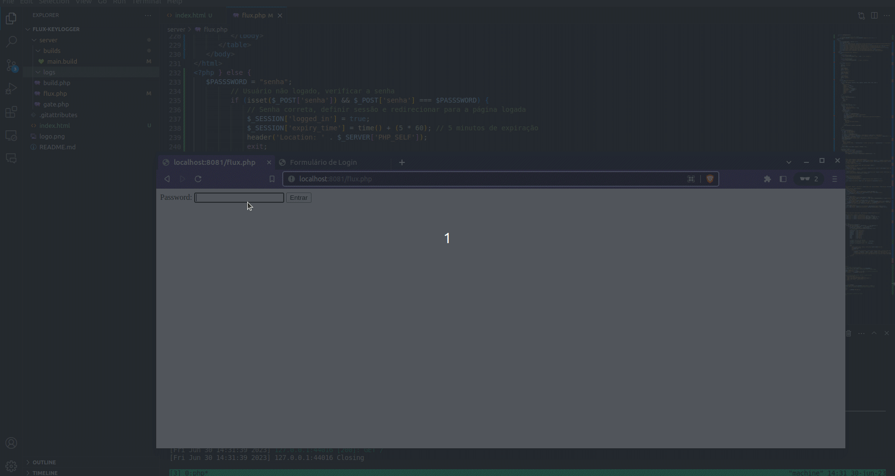
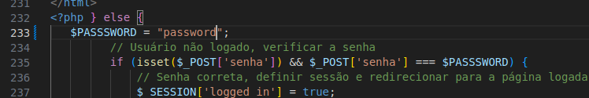

# Flux-Keylogger
> Simple javascript keylogger with web panel 

  

## Demo:

## Improvements
* Dashboard Password
* Tag Filter `<tab>, <enter>`
* Improvement in the code to get HOST, PROTOCOL, etc...

## Logs:
* Keylogger
* Cookies
* Location
* Remote IP
* User-Agents

## Installation server files:
* upload files from `server` directory to you server
* go to http://you.host/flux.php
* click build
* Now inject script tag to other documents
* Change Password 

